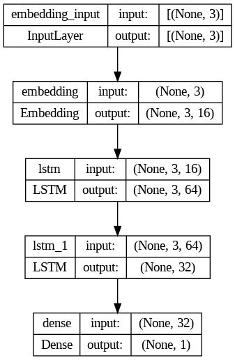

# Html-Code-Corrector

## Dataset

The dataset contains incorrect codes and their correct codes in html. The dataset is generated synthetically and there are 5157 unique examples.

## Preprocessing

Dataset is first transformed from text to sequences then labelled as 0 for bad and 1 for good. The dataset is then split 20% is used for validation and 20% is used for testing.

## Model

Model has 2 LSTM cells first cell has 64 neurons and second cell has 32 neurons. Model is trained for 20 epochs.



## Results
Intially the results are as follows:

- Training Accuracy 92% and Validation Accuracy is 92%


- Test Accuracy is 90%


Bad HTML code examples are given below:

- ```<p>This is bad```
- ```<center>Centered content```
- ```<div style='color: red'>```
- ```<table><tr><td>Layout</td></tr></table>```
- ``````
- ```This is content```
- ```<div custom-attr='value'>```
- ```<div id='duplicateID'>```
- ``````
- ```<div>This is div</div>```

Link to website for testing purpose is:
[HTML Code Corrector](https://html-code-corrector-app.streamlit.app/)